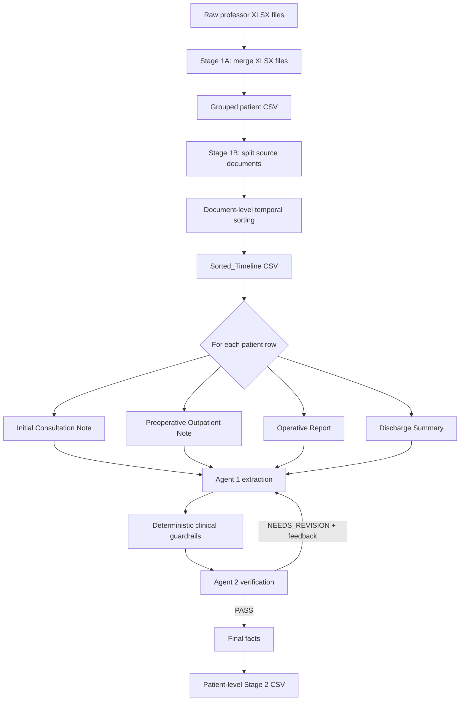

# Medical Report Summarization Agent

Clinical document ordering and core-fact extraction pipeline for structured
medical report summarization.

This repository contains code and documentation only. Raw clinical records,
intermediate CSVs, generated outputs, and model artifacts are intentionally
excluded from version control.

## What This Pipeline Does

The project currently implements two stages:

| Stage | Name | Method | Output |
| --- | --- | --- | --- |
| Stage 1A | XLSX merge | Rule-based pandas merge | One patient-level CSV |
| Stage 1B | Document temporal sorting | Deterministic date/phase sorting | `Sorted_Timeline` |
| Stage 2 | Core fact extraction and verification | Multi-agent Ollama loop | Verified clinical facts |

Stage 1 is deterministic and does not call an LLM. Stage 2 uses two local
Ollama agents:

- Agent 1: extracts clinically important facts from each document chunk.
- Agent 2: verifies extracted facts against the original chunk and sends
  feedback for recursive correction.

## Architecture



## Repository Layout

```text
.
├── stage1_merge_chatml_all.py
├── stage1_temporal_document_sort.py
├── stage2_core_fact_extraction_verification.py
├── requirements.txt
├── docs/
│   ├── pipeline.md
│   ├── commands.md
│   └── data_policy.md
└── .gitignore
```

Files intentionally not included:

- `outputs/`
- raw `.xlsx` files
- generated `.csv`, `.json`, `.jsonl`, `.md` reports
- `__pycache__/`
- old exploratory scripts

## Installation

```bash
cd /path/to/Medical_Report_Summarization_Agent
python -m pip install -r requirements.txt
```

Install and run Ollama separately, then pull the current Stage 2 model:

```bash
ollama pull qwen3.5:9b
```

## Quick Start

### Stage 1A: merge raw XLSX files

```bash
python stage1_merge_chatml_all.py \
  --input-dir /path/to/chatml_All \
  --output-csv outputs/chatml_All_grouped_professor_patient.csv
```

### Stage 1B: document-level temporal sorting

```bash
python stage1_temporal_document_sort.py \
  --input-csv outputs/chatml_All_grouped_professor_patient.csv \
  --output-csv outputs/chatml_All_document_temporal_sorted.csv \
  --output-json outputs/stage1_temporal_sort_metadata.json \
  --skip-json \
  --max-patients 0
```

### Stage 2: fact extraction and verification

Smoke test:

```bash
python stage2_core_fact_extraction_verification.py \
  --input-csv outputs/chatml_All_document_temporal_sorted.csv \
  --output-csv outputs/stage2_10rows_fact_extraction_qwen35_9b.csv \
  --extractor-model qwen3.5:9b \
  --verifier-model qwen3.5:9b \
  --max-patients 10 \
  --max-iterations 2 \
  --num-ctx 12000 \
  --num-predict 4096 \
  --save-every 1
```

Full run:

```bash
python stage2_core_fact_extraction_verification.py \
  --input-csv outputs/chatml_All_document_temporal_sorted.csv \
  --output-csv outputs/stage2_all_fact_extraction_qwen35_9b.csv \
  --extractor-model qwen3.5:9b \
  --verifier-model qwen3.5:9b \
  --max-patients 0 \
  --max-iterations 2 \
  --coverage-threshold 0.85 \
  --evidence-threshold 0.95 \
  --num-ctx 12000 \
  --num-predict 4096 \
  --save-every 10 \
  --skip-readable-report
```

## Stage 2 Verification Policy

Current pass criteria are intentionally balanced:

- `coverage_score >= 0.85`
- `evidence_support_score >= 0.95`
- no unsupported facts
- no contradictions
- no date errors
- no critical missing facts
- no clinical accuracy issues

Minor missing details such as baseline weight, BMI, or routine LFT values do not
block a PASS unless they are clinically central to the record.

## Clinical Guardrails

Stage 2 includes deterministic checks for high-risk extraction details:

- PFT mapping: FVC/FEV1/FEV1-FVC values must not be swapped.
- Operative outcome: complete enucleation and mucosal status are preserved.
- Conversion taxonomy: VATS-to-thoracotomy conversion is `Procedure Change`, not
  `Complication`, unless the source explicitly states otherwise.
- Intraoperative findings: chest tube placement, lung surface repair, and azygos
  vein division are preserved when present.
- Prompt-leak protection: facts that appear copied from prompt guidance but are
  absent from the source chunk are removed.

## Data Safety

This repository is public-facing code. Do not commit raw clinical records or
generated patient-level outputs. See [docs/data_policy.md](docs/data_policy.md)
for the data handling policy.

