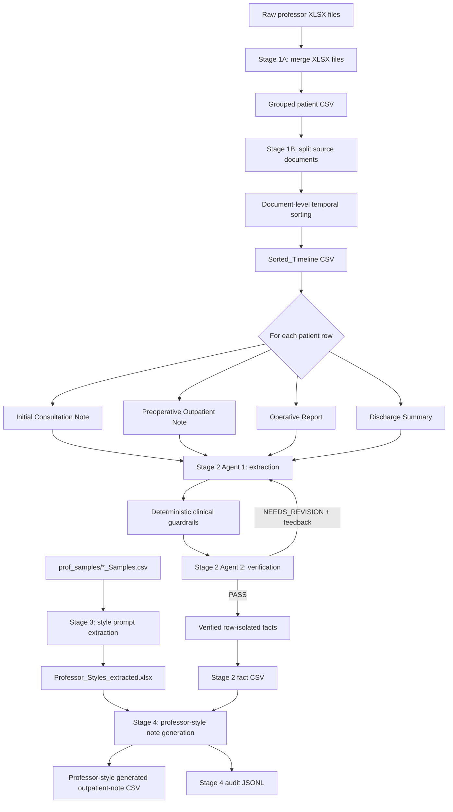

# Medical Report Summarization Agent

Clinical document ordering, fact extraction, professor-style prompt extraction,
and fact-grounded outpatient-note generation pipeline for structured medical
report summarization.

This repository contains code and documentation only. Raw clinical records,
intermediate CSVs, generated outputs, style workbooks, audit logs, and model
artifacts are intentionally excluded from version control.

## What This Pipeline Does

The project currently implements four stages:

| Stage | Name | Method | Main output |
| --- | --- | --- | --- |
| Stage 1A | XLSX merge | Rule-based pandas merge | One patient-level CSV |
| Stage 1B | Document temporal sorting | Deterministic date/phase sorting | `Sorted_Timeline` |
| Stage 2 | Core fact extraction and verification | Multi-agent Ollama loop | Verified row-isolated clinical facts |
| Stage 3 | Professor style prompt extraction | Ollama-based style analysis over professor sample notes | `Professor_Styles_extracted.xlsx` |
| Stage 4 | Professor-style outpatient-note generation | Fact-grounded Ollama generation with professor-specific style prompts | Professor-style generated outpatient notes |

Stage 1 is deterministic and does not call an LLM. Stage 2 uses two local
Ollama agents:

- Agent 1: extracts clinically important facts from each document chunk.
- Agent 2: verifies extracted facts against the original chunk and sends
  feedback for recursive correction.

Stage 3 uses real professor-specific outpatient-note samples to extract compact
style prompts. The style prompts are designed to capture not only wording and
formatting, but also **content-selection behavior**: what each professor usually
keeps, what each professor omits, how compactly they write, and how strongly the
note should avoid operative-summary over-generation.

Stage 4 generates final outpatient notes from Stage 2 facts. It treats each CSV
row as an isolated fact bundle, matches the row to the corresponding professor
style prompt, and generates a note using only facts explicitly present in that
row.

## Architecture



## Repository Layout

```text
.
├── stage1_merge_chatml_all.py
├── stage1_temporal_document_sort.py
├── stage2_core_fact_extraction_verification.py
├── stage3_extract_professor_styles_ollama.py
├── stage4_generate_professor_style_notes.py
├── requirements.txt
├── docs/
│   ├── pipeline.md
│   ├── commands.md
│   └── data_policy.md
└── .gitignore
```

Files intentionally not included:

- `inputs/`
- `outputs/`
- `prof_samples/`
- raw `.xlsx` files
- generated `.csv`, `.json`, `.jsonl`, `.xlsx`, `.md` reports
- style prompt workbooks such as `Professor_Styles_extracted.xlsx`
- audit logs such as `Professor_Styles_extracted_audit.jsonl`
- `__pycache__/`
- old exploratory scripts

## Installation

```bash
cd /path/to/Medical_Report_Summarization_Agent
python -m pip install -r requirements.txt
```

Install and run Ollama separately, then pull the default model:

```bash
ollama pull qwen3.5:9b
```

Useful optional check:

```bash
ollama list
```

## Quick Start

### Stage 1A: merge raw XLSX files

```bash
python stage1_merge_chatml_all.py \
  --input-dir /path/to/chatml_All \
  --output-csv outputs/chatml_All_grouped_professor_patient.csv
```

### Stage 1B: document-level temporal sorting

```bash
python stage1_temporal_document_sort.py \
  --input-csv outputs/chatml_All_grouped_professor_patient.csv \
  --output-csv outputs/chatml_All_document_temporal_sorted.csv \
  --output-json outputs/stage1_temporal_sort_metadata.json \
  --skip-json \
  --max-patients 0
```

### Stage 2: fact extraction and verification

Smoke test:

```bash
python stage2_core_fact_extraction_verification.py \
  --input-csv outputs/chatml_All_document_temporal_sorted.csv \
  --output-csv outputs/stage2_10rows_fact_extraction_qwen35_9b.csv \
  --extractor-model qwen3.5:9b \
  --verifier-model qwen3.5:9b \
  --max-patients 10 \
  --max-iterations 2 \
  --num-ctx 12000 \
  --num-predict 4096 \
  --save-every 1
```

Full run:

```bash
python stage2_core_fact_extraction_verification.py \
  --input-csv outputs/chatml_All_document_temporal_sorted.csv \
  --output-csv outputs/stage2_all_fact_extraction_qwen35_9b.csv \
  --extractor-model qwen3.5:9b \
  --verifier-model qwen3.5:9b \
  --max-patients 0 \
  --max-iterations 2 \
  --coverage-threshold 0.85 \
  --evidence-threshold 0.95 \
  --num-ctx 12000 \
  --num-predict 4096 \
  --save-every 10 \
  --skip-readable-report
```

### Stage 3: extract professor-specific style prompts

Stage 3 reads professor-specific reference note samples from `prof_samples/`.
The expected filename pattern is:

```text
prof_samples/
├── 강창현_Samples.csv
├── 한원식_Samples.csv
└── ...
```

Each CSV should contain real reference outpatient-note examples. The script
automatically searches for reference-output columns such as:

```text
output, Output, actual_output, reference_output, GT, ground_truth,
note, outpatient_note, 외래기록지, 실제외래기록지
```

Optional source-input columns such as `input`, `Input`, `source`, or `의료기록지`
can be included. They are used only as contextual evidence for style analysis.
The final extracted style prompt must not copy patient-specific facts.

Smoke test for one professor:

```bash
python stage3_extract_professor_styles_ollama.py \
  --input_dir prof_samples \
  --professor 강창현 \
  --output_xlsx outputs/Professor_Styles_강창현_test.xlsx \
  --audit_jsonl outputs/Professor_Styles_강창현_test_audit.jsonl \
  --model qwen3.5:9b \
  --ollama_num_ctx 16384 \
  --num_predict 2600
```

Full style extraction:

```bash
python stage3_extract_professor_styles_ollama.py \
  --input_dir prof_samples \
  --output_xlsx outputs/Professor_Styles_extracted.xlsx \
  --audit_jsonl outputs/Professor_Styles_extracted_audit.jsonl \
  --model qwen3.5:9b \
  --ollama_num_ctx 16384 \
  --num_predict 2600 \
  --max_examples 18 \
  --target_style_chars 1600
```

Dry run without calling Ollama:

```bash
python stage3_extract_professor_styles_ollama.py \
  --input_dir prof_samples \
  --dry_run \
  --output_xlsx outputs/Professor_Styles_dryrun.xlsx \
  --audit_jsonl outputs/Professor_Styles_dryrun_audit.jsonl
```

Stage 3 output workbook:

| Sheet | Purpose |
| --- | --- |
| `Sheet1` | Agent-compatible `professor`, `style_prompt` table |
| `Style_JSON` | Structured style analysis, length policy, omit rules, abbreviation rules |
| `Extraction_Audit` | Source file, detected columns, statistics, examples, model metadata |
| `Common_Prompts` | Recommended global safety and compactness prompts for Stage 4 |

### Stage 4: generate professor-style outpatient notes

Stage 4 reads the verified Stage 2 fact CSV and the Stage 3 style workbook. It
matches each row's `Professor_ID` to `Sheet1.professor`, then generates one
professor-style note per selected row.

Smoke test:

```bash
python stage4_generate_professor_style_notes.py \
  --facts_csv outputs/stage2_10rows_fact_extraction_qwen35_9b.csv \
  --styles_xlsx outputs/Professor_Styles_extracted.xlsx \
  --output_csv outputs/professor_style_outpatient_notes_test.csv \
  --audit_jsonl outputs/professor_style_outpatient_notes_test_audit.jsonl \
  --backend ollama \
  --model qwen3.5:9b \
  --max_rows 10 \
  --max_tokens 1200 \
  --ollama_num_ctx 16384 \
  --strict_validation
```

Full run:

```bash
python stage4_generate_professor_style_notes.py \
  --facts_csv outputs/stage2_all_fact_extraction_qwen35_9b.csv \
  --styles_xlsx outputs/Professor_Styles_extracted.xlsx \
  --output_csv outputs/professor_style_outpatient_notes.csv \
  --audit_jsonl outputs/professor_style_outpatient_notes_audit.jsonl \
  --backend ollama \
  --model qwen3.5:9b \
  --max_tokens 1200 \
  --ollama_num_ctx 16384 \
  --request_retries 2 \
  --strict_validation
```

Useful options:

| Option | Stage | Meaning |
| --- | --- | --- |
| `--professor <name>` | Stage 3, 4 | Process only one professor |
| `--dry_run` | Stage 3, 4 | Test file plumbing without real generation |
| `--continue_on_error` | Stage 3 | Continue style extraction even if one professor fails |
| `--skip_unmatched` | Stage 4 | Skip rows whose `Professor_ID` has no matching style |
| `--save_prompts` | Stage 4 | Store full generation messages in audit JSONL |
| `--strict_validation` | Stage 4 | Apply stricter generated-note validation warnings |
| `--keep_thinking` | Stage 4 | Do not strip `<think>` blocks from reasoning models; normally not recommended |

## Stage 2 Verification Policy

Current pass criteria are intentionally balanced:

- `coverage_score >= 0.85`
- `evidence_support_score >= 0.95`
- no unsupported facts
- no contradictions
- no date errors
- no critical missing facts
- no clinical accuracy issues

Minor missing details such as baseline weight, BMI, or routine LFT values do not
block a PASS unless they are clinically central to the record.

## Stage 3 Style Extraction Policy

Stage 3 is optimized for professor-specific **content-selection style**, not only
surface wording. The extractor asks Ollama to identify:

- typical note length and compactness
- whether the professor uses section headers, bullets, numbered lists, or plain
  note-body format
- abbreviation and date-format habits
- which clinical anchors are usually preserved
- which factual details are usually omitted
- whether operative technical details, routine negative findings, discharge
  course, long past history, or incidental comorbidities should be excluded

The extracted `style_prompt` must not contain fixed patient-specific facts from
sample notes. It should use placeholders such as `[diagnosis]`, `[operation]`,
`[date]`, and `[status]`.

## Stage 4 Generation Policy

Stage 4 is designed for safety-critical, fact-grounded outpatient-note generation.
Important rules:

- Each row is treated as an isolated fact bundle.
- Only `CURRENT_ROW_FACTS` can be used as patient evidence.
- Professor style prompts control formatting, abbreviation, compactness, content
  priority, and omission policy only.
- Professor style prompts are not clinical fact sources.
- The generator must not summarize the operative report.
- The generator must not write a discharge summary.
- Factual but low-priority details should be omitted when they are not typical of
  the professor's reference outpatient notes.
- Core outpatient-note anchors should be preserved if explicitly supported and
  typical for the professor: main diagnosis or R/O diagnosis, main operation or
  procedure, date, and short post-op/follow-up/status phrase.

Stage 4 also strips local reasoning-model artifacts such as `<think>...</think>`
from generated output unless `--keep_thinking` is explicitly used.

## LLM-as-a-Judge Evaluation

The current evaluation uses a reference-based LLM-as-a-Judge style scoring
protocol. For each case, the generated outpatient note is compared against the
real reference `Output` note. The original `Input` record is used as supporting
context to check whether the generated content is grounded in the source record.

All reported scores except `Length ratio` are normalized to a 0-100 scale, where
higher is better. These scores are proxy evaluation metrics for development and
model selection; they are not a guarantee of clinical correctness.

### Metric definitions

| Metric | Meaning |
| --- | --- |
| `Overall` | Composite 0-100 score summarizing reference alignment, entity matching, compactness, and grounding behavior. |
| `Reference alignment` | How closely the generated note matches the real reference outpatient note in wording, structure, ordering, and note-like style. |
| `Entity F1` | Harmonic-style summary of entity precision and recall for clinically important anchors such as diagnosis, procedure, date, pathology, treatment, status, and numeric values. |
| `Entity precision` | Among entities written in the generated note, the proportion that also appears to be supported by the reference note. Low precision usually indicates over-generation. |
| `Entity recall` | Among important entities in the reference note, the proportion recovered by the generated note. Low recall usually indicates over-compression or missing core anchors. |
| `Brevity` | Compactness score relative to the reference outpatient note. Higher scores indicate less operative-summary over-generation and better note-length control. |
| `Length ratio` | Generated-note length divided by reference-note length. A value near `1.0x` is ideal; values above `1.0x` indicate longer outputs, while values below `1.0x` indicate stronger compression. |
| `>=50` / `<50` | Number of evaluated cases above or below a 50-point case-level `Overall` score threshold. |

### Prompt-version leaderboard

The following summary table compares four Stage 4 prompt/style-generation
versions on the 21-professor evaluation set. The evaluation is row-level over
439 rows derived from the 21-professor sample set.

| Version | Overall | Reference alignment | Entity F1 | Entity precision | Entity recall | Brevity | Length ratio | >=50 | <50 | Interpretation |
| --- | ---: | ---: | ---: | ---: | ---: | ---: | ---: | ---: | ---: | --- |
| `v1` | **58.65** | **49.19** | **49.27** | 52.68 | **56.96** | 76.43 | 1.67x | **303** | **136** | Best default version overall; strongest balance between recall and compactness. |
| `v2` | 56.14 | 46.35 | 45.83 | 49.18 | 54.26 | 74.14 | 1.99x | 288 | 151 | Slight regression from v1; useful only for selected professors. |
| `v3` | 44.74 | 34.92 | 30.81 | 34.66 | 45.88 | 61.76 | 2.91x | 105 | 334 | Not recommended; tends to over-generate and drift toward operative-summary style. |
| `v4` | 56.25 | 46.37 | 45.03 | **56.07** | 45.54 | **77.31** | **0.89x** | 296 | 143 | Strongest compression and precision, but lower recall; useful for over-generating professors. |

Current model-selection rule:

- Use `v1` as the default Stage 4 prompt version.
- Consider `v4` for professors whose outputs are consistently over-generated by
  `v1`, especially when brevity and entity precision are more important than
  recall.
- Do not use `v3` as a default prompt version.
- Treat the leaderboard as a development benchmark. Final clinical validation
  should include physician review of factual correctness, omission errors,
  over-generation, and professor-style match.

## Clinical Guardrails

Stage 2 includes deterministic checks for high-risk extraction details:

- PFT mapping: FVC/FEV1/FEV1-FVC values must not be swapped.
- Operative outcome: complete enucleation and mucosal status are preserved.
- Conversion taxonomy: VATS-to-thoracotomy conversion is `Procedure Change`, not
  `Complication`, unless the source explicitly states otherwise.
- Intraoperative findings: chest tube placement, lung surface repair, and azygos
  vein division are preserved when present.
- Prompt-leak protection: facts that appear copied from prompt guidance but are
  absent from the source chunk are removed.

Stage 4 adds generated-note validation checks for suspicious unsupported phrases,
dates, numbers, medical terms, possible style-prompt leakage, and output
truncation. These validation warnings are screening signals, not a guarantee of
clinical correctness. Any generated medical record should be reviewed before
clinical use.

## Data Safety

This repository is public-facing code. Do not commit raw clinical records,
professor sample CSVs, extracted facts, generated notes, style workbooks, audit
logs, or model outputs.

In particular, do not commit:

- `prof_samples/`
- `inputs/`
- `outputs/`
- `Professor_Styles*.xlsx`
- `*_audit.jsonl`
- generated note CSVs

See [docs/data_policy.md](docs/data_policy.md) for the data handling policy.
