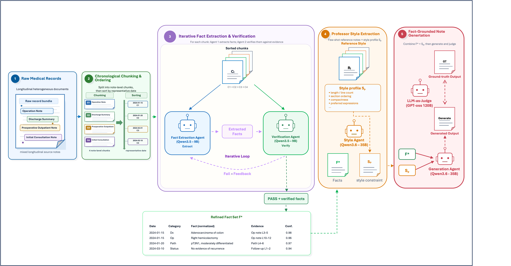

# Medical Report Summarization Agent

Clinical document ordering, fact extraction, few-shot reference-style
extraction, and fact-grounded medical note generation pipeline with local
Ollama models.

This repository contains code and documentation only. Raw clinical records,
intermediate CSVs, generated outputs, style workbooks, audit logs, and model
artifacts are intentionally excluded from version control.

## What This Pipeline Does



The current framework runs deterministic preprocessing first, then uses local
Ollama agents for verified fact extraction and reference-style note generation.

| Stage | Name | Method | Main output |
| --- | --- | --- | --- |
| Stage 1 | XLSX merge | Rule-based pandas merge | One patient-level CSV |
| Stage 2 | Document temporal sorting | Deterministic date/phase sorting | `Sorted_Timeline` |
| Stage 3 | Core fact extraction and verification | Multi-agent Ollama loop | Verified row-isolated clinical facts |
| Stage 4/5 | Few-shot style extraction and final note generation | Reference outputs + local Ollama generation | `generated_notes.csv`, audit JSONL, style cache JSONL |

Stage 1 and Stage 2 are deterministic and do not call an LLM. Stage 3 uses two
local Ollama agents:

- Agent 1: extracts clinically important facts from each document chunk.
- Agent 2: verifies extracted facts against the original chunk and sends
  feedback for recursive correction.

The active Stage 4/5 path is
`pipeline/stage4_5_fewshot_professor_style_agents.py`. It uses Stage 3 facts
plus approximately five reference output examples.
Each reference row is treated as an independent style example; the agent extracts
a reusable style profile, then generates one final note per selected input row
using only that row's Stage 3 facts.

## Repository Layout

```text
.
├── pipeline/
│   ├── __init__.py
│   ├── stage1_merge_chatml_all.py
│   ├── stage2_temporal_document_sort.py
│   ├── stage3_core_fact_extraction_verification.py
│   └── stage4_5_fewshot_professor_style_agents.py
├── stage3_extract_professor_styles_ollama.py
├── stage4_generate_professor_style_notes.py
├── streamlit_app.py
├── web_pipeline.py
├── mainfigure.png
├── requirements.txt
├── docs/
│   ├── pipeline.md
│   ├── commands.md
│   └── data_policy.md
└── .gitignore
```

Files intentionally not included:

- `inputs/`
- `outputs/`
- `prof_samples/`
- raw `.xlsx` files
- generated `.csv`, `.json`, `.jsonl`, `.xlsx`, `.md` reports
- style prompt workbooks such as `Professor_Styles_extracted.xlsx`
- audit logs such as `Professor_Styles_extracted_audit.jsonl`
- `__pycache__/`
- old exploratory scripts

## Installation

```bash
cd /path/to/Medical_Report_Summarization_Agent
python -m pip install -r requirements.txt
```

Install and run Ollama separately, then pull the default models used by the CLI
pipeline:

```bash
ollama pull qwen3.6:35b
ollama pull qwen3.5:9b
```

Useful optional check:

```bash
ollama list
```

## Quick Start

### Stage 1: merge raw XLSX files

```bash
python pipeline/stage1_merge_chatml_all.py \
  --input-dir /path/to/chatml_All \
  --output-csv outputs/chatml_All_grouped_professor_patient.csv
```

### Stage 2: document-level temporal sorting

```bash
python pipeline/stage2_temporal_document_sort.py \
  --input-csv outputs/chatml_All_grouped_professor_patient.csv \
  --output-csv outputs/chatml_All_document_temporal_sorted.csv \
  --output-json outputs/stage2_temporal_sort_metadata.json \
  --skip-json \
  --max-patients 0
```

### Stage 3: fact extraction and verification

Smoke test:

```bash
python pipeline/stage3_core_fact_extraction_verification.py \
  --input-csv outputs/chatml_All_document_temporal_sorted.csv \
  --output-csv outputs/stage3_10rows_fact_extraction_qwen35_9b.csv \
  --extractor-model qwen3.5:9b \
  --verifier-model qwen3.5:9b \
  --max-patients 10 \
  --max-iterations 2 \
  --num-ctx 12000 \
  --num-predict 4096 \
  --save-every 1
```

Full run:

```bash
python pipeline/stage3_core_fact_extraction_verification.py \
  --input-csv outputs/chatml_All_document_temporal_sorted.csv \
  --output-csv outputs/stage3_all_fact_extraction_qwen35_9b.csv \
  --extractor-model qwen3.5:9b \
  --verifier-model qwen3.5:9b \
  --max-patients 0 \
  --max-iterations 2 \
  --coverage-threshold 0.85 \
  --evidence-threshold 0.95 \
  --num-ctx 12000 \
  --num-predict 4096 \
  --save-every 10 \
  --skip-readable-report
```

### Stage 4/5: few-shot style extraction and note generation

The current default Stage 4/5 script is:

```text
pipeline/stage4_5_fewshot_professor_style_agents.py
```

It reads:

- `--facts_csv`: Stage 3 output CSV with row-isolated facts.
- `--reference_csv`: reference output examples normalized to columns
  `Professor_ID`, `수술ID`, `Input`, and `Output`.

It writes:

- `--output_csv`: final generated notes, including the `generated_note` column.
- `--audit_jsonl`: per-row generation audit and validation metadata.
- `--style_cache_jsonl`: extracted few-shot style profile and reference ids.

Create a reference CSV like this:

```csv
Professor_ID,수술ID,Input,Output
example_professor,1,,"<|section_start|>Description <- 소견<|section_end|>
17.3.30 Robot Mckeown 3FLND
d/t Eso ca UI 30cm cT1bN0M0"
example_professor,2,,"<second reference output>"
```

Each row is one independent reference style example. If all reference examples
share an opening line such as:

```text
<|section_start|>Description <- 소견<|section_end|>
```

the Stage 4/5 agent detects it as a common style wrapper and asks the generator
to preserve it exactly.

Smoke test using Stage 3 facts and five reference examples:

```bash
python pipeline/stage4_5_fewshot_professor_style_agents.py \
  --facts_csv outputs/stage3_verified_facts.csv \
  --reference_csv outputs/reference_examples.csv \
  --output_csv outputs/generated_notes.csv \
  --audit_jsonl outputs/generated_notes_audit.jsonl \
  --style_cache_jsonl outputs/fewshot_professor_style_prompts.jsonl \
  --model qwen3.6:35b \
  --sample_count 5 \
  --max_rows 1 \
  --strict_validation \
  --no_progress
```

Separate models can be used for style extraction and note generation:

```bash
python pipeline/stage4_5_fewshot_professor_style_agents.py \
  --facts_csv outputs/stage3_verified_facts.csv \
  --reference_csv outputs/reference_examples.csv \
  --output_csv outputs/generated_notes.csv \
  --audit_jsonl outputs/generated_notes_audit.jsonl \
  --style_cache_jsonl outputs/fewshot_professor_style_prompts.jsonl \
  --style_model qwen3.6:35b \
  --generator_model qwen3.6:35b \
  --sample_count 5 \
  --strict_validation
```

Dry run without LLM generation:

```bash
python pipeline/stage4_5_fewshot_professor_style_agents.py \
  --facts_csv outputs/stage3_verified_facts.csv \
  --reference_csv outputs/reference_examples.csv \
  --output_csv outputs/generated_notes_dryrun.csv \
  --audit_jsonl outputs/generated_notes_dryrun_audit.jsonl \
  --style_cache_jsonl outputs/fewshot_professor_style_prompts_dryrun.jsonl \
  --dry_run \
  --sample_count 5 \
  --no_progress
```

In dry-run mode, `generated_note` is a placeholder and
`validation_status=dry_run`.

Useful Stage 4/5 options:

| Option | Meaning |
| --- | --- |
| `--sample_count 5` | Number of reference outputs to use per professor |
| `--max_rows <n>` | Limit generated target rows for a smoke test |
| `--professor <name>` | Process only one professor |
| `--dry_run` | Test file plumbing without real LLM calls |
| `--skip_unmatched` | Skip rows whose `Professor_ID` has no matching references |
| `--save_prompts` | Store full prompts in outputs and audit JSONL |
| `--strict_validation` | Add stricter generated-note validation warnings |
| `--keep_thinking` | Do not strip `<think>` blocks; normally not recommended |
| `--ollama_host <url>` | Use a non-default Ollama server |

### Legacy split style and generation scripts

The older split scripts are still present:

```text
stage3_extract_professor_styles_ollama.py
stage4_generate_professor_style_notes.py
```

Use them only when you specifically need the workbook-based style prompt flow:

```bash
python stage3_extract_professor_styles_ollama.py \
  --input_dir prof_samples \
  --output_xlsx outputs/Professor_Styles_extracted.xlsx \
  --audit_jsonl outputs/Professor_Styles_extracted_audit.jsonl \
  --model qwen3.5:9b \
  --target_style_chars 1600

python stage4_generate_professor_style_notes.py \
  --facts_csv outputs/stage3_all_fact_extraction_qwen35_9b.csv \
  --styles_xlsx outputs/Professor_Styles_extracted.xlsx \
  --output_csv outputs/professor_style_outpatient_notes.csv \
  --audit_jsonl outputs/professor_style_outpatient_notes_audit.jsonl \
  --model qwen3.5:9b \
  --strict_validation
```

## Stage 3 Verification Policy

Current pass criteria are intentionally balanced:

- `coverage_score >= 0.85`
- `evidence_support_score >= 0.95`
- no unsupported facts
- no contradictions
- no date errors
- no critical missing facts
- no clinical accuracy issues

Minor missing details such as baseline weight, BMI, or routine LFT values do not
block a PASS unless they are clinically central to the record.

## Stage 4/5 Few-Shot Style Policy

The active Stage 4/5 agent is optimized for professor-specific
**content-selection style**, not only surface wording. It asks Ollama to infer a
style profile from the selected reference output examples, while deterministic
guards capture common wrappers such as a shared first line.

The style profile captures:

- typical output length and compactness
- whether the references use section headers, bullets, numbered lists, or plain
  body format
- common opening lines that should be preserved exactly
- abbreviation and date-format habits
- which clinical anchors are usually preserved
- which factual details are usually omitted
- whether operative technical details, routine negative findings, discharge
  course, long past history, or incidental comorbidities should be excluded

The extracted `style_prompt` must not contain fixed patient-specific facts from
sample notes. It should use placeholders such as `[diagnosis]`, `[operation]`,
`[date]`, and `[status]`.

## Stage 4/5 Generation Policy

The generation half of Stage 4/5 is designed for safety-critical, fact-grounded
clinical document generation. Important rules:

- Each row is treated as an isolated fact bundle.
- Only `CURRENT_ROW_FACTS` can be used as patient evidence.
- Reference-derived style prompts control formatting, abbreviation, compactness, content
  priority, and omission policy only.
- Style prompts and reference examples are not clinical fact sources.
- If all reference examples share a section header or opening line, preserve it
  exactly as formatting.
- The generator must not summarize the operative report.
- The generator must not write a discharge summary.
- Factual but low-priority details should be omitted when they are not typical of
  the reference output style.
- Core anchors should be preserved if explicitly supported and typical for the
  requested output style: main diagnosis or R/O diagnosis, main operation or
  procedure, date, and short post-op/follow-up/status phrase.

Stage 4/5 strips local reasoning-model artifacts such as `<think>...</think>`
from generated output unless `--keep_thinking` is explicitly used. Dry-run
outputs are marked with `validation_status=dry_run` so placeholders are not
mistaken for generated clinical notes.

## LLM-as-a-Judge Evaluation

The historical evaluation uses a reference-based LLM-as-a-Judge style scoring
protocol. For each case, the generated outpatient note is compared against the
real reference `Output` note. The original `Input` record is used as supporting
context to check whether the generated content is grounded in the source record.

All reported scores except `Length ratio` are normalized to a 0-100 scale, where
higher is better. These scores are proxy evaluation metrics for development and
model selection; they are not a guarantee of clinical correctness.

### Metric definitions

| Metric | Meaning |
| --- | --- |
| `Overall` | Composite 0-100 score summarizing reference alignment, entity matching, compactness, and grounding behavior. |
| `Reference alignment` | How closely the generated note matches the real reference outpatient note in wording, structure, ordering, and note-like style. |
| `Entity F1` | Harmonic-style summary of entity precision and recall for clinically important anchors such as diagnosis, procedure, date, pathology, treatment, status, and numeric values. |
| `Entity precision` | Among entities written in the generated note, the proportion that also appears to be supported by the reference note. Low precision usually indicates over-generation. |
| `Entity recall` | Among important entities in the reference note, the proportion recovered by the generated note. Low recall usually indicates over-compression or missing core anchors. |
| `Brevity` | Compactness score relative to the reference outpatient note. Higher scores indicate less operative-summary over-generation and better note-length control. |
| `Length ratio` | Generated-note length divided by reference-note length. A value near `1.0x` is ideal; values above `1.0x` indicate longer outputs, while values below `1.0x` indicate stronger compression. |
| `>=50` / `<50` | Number of evaluated cases above or below a 50-point case-level `Overall` score threshold. |

### Prompt-version leaderboard

The following summary table compares four legacy Stage 4 prompt/style-generation
versions on the 21-professor evaluation set. The evaluation is row-level over
439 rows derived from the 21-professor sample set. Treat this as historical
context for prompt behavior; the current web path uses the unified Stage 4/5
few-shot agent.

| Version | Overall | Reference alignment | Entity F1 | Entity precision | Entity recall | Brevity | Length ratio | >=50 | <50 | Interpretation |
| --- | ---: | ---: | ---: | ---: | ---: | ---: | ---: | ---: | ---: | --- |
| `v1` | **58.65** | **49.19** | **49.27** | 52.68 | **56.96** | 76.43 | 1.67x | **303** | **136** | Best default version overall; strongest balance between recall and compactness. |
| `v2` | 56.14 | 46.35 | 45.83 | 49.18 | 54.26 | 74.14 | 1.99x | 288 | 151 | Slight regression from v1; useful only for selected professors. |
| `v3` | 44.74 | 34.92 | 30.81 | 34.66 | 45.88 | 61.76 | 2.91x | 105 | 334 | Not recommended; tends to over-generate and drift toward operative-summary style. |
| `v4` | 56.25 | 46.37 | 45.03 | **56.07** | 45.54 | **77.31** | **0.89x** | 296 | 143 | Strongest compression and precision, but lower recall; useful for over-generating professors. |

Historical model-selection rule for the legacy split Stage 4 flow:

- Use `v1` as the default legacy Stage 4 prompt version.
- Consider `v4` for professors whose outputs are consistently over-generated by
  `v1`, especially when brevity and entity precision are more important than
  recall.
- Do not use `v3` as a default prompt version.
- Treat the leaderboard as a development benchmark. Final clinical validation
  should include physician review of factual correctness, omission errors,
  over-generation, and professor-style match.

## Clinical Guardrails

Stage 3 includes deterministic checks for high-risk extraction details:

- PFT mapping: FVC/FEV1/FEV1-FVC values must not be swapped.
- Operative outcome: complete enucleation and mucosal status are preserved.
- Conversion taxonomy: VATS-to-thoracotomy conversion is `Procedure Change`, not
  `Complication`, unless the source explicitly states otherwise.
- Intraoperative findings: chest tube placement, lung surface repair, and azygos
  vein division are preserved when present.
- Prompt-leak protection: facts that appear copied from prompt guidance but are
  absent from the source chunk are removed.

Stage 4/5 adds generated-note validation checks for suspicious unsupported phrases,
dates, numbers, medical terms, possible style-prompt leakage, and output
truncation. These validation warnings are screening signals, not a guarantee of
clinical correctness. Any generated medical record should be reviewed before
clinical use.

## Data Safety

This repository is public-facing code. Do not commit raw clinical records,
professor sample CSVs, extracted facts, generated notes, style workbooks, audit
logs, or model outputs.

In particular, do not commit:

- `prof_samples/`
- `inputs/`
- `outputs/`
- `Professor_Styles*.xlsx`
- `*_audit.jsonl`
- generated note CSVs

See [docs/data_policy.md](docs/data_policy.md) for the data handling policy.
