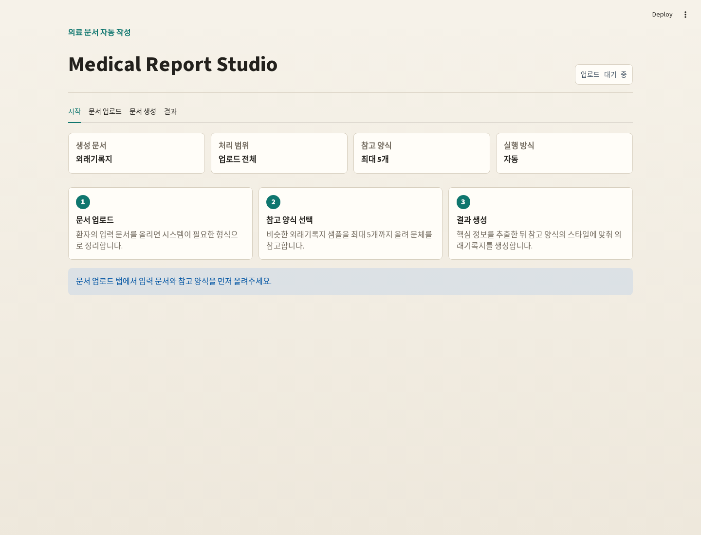

# Medical Report Summarization Agent

Clinical document ordering, fact extraction, few-shot reference-style
extraction, and fact-grounded medical note generation pipeline with local
Ollama models.

This repository contains code and documentation only. Raw clinical records,
intermediate CSVs, generated outputs, style workbooks, audit logs, and model
artifacts are intentionally excluded from version control.

## What This Pipeline Does


The current framework runs deterministic preprocessing first, then uses local
Ollama agents for verified fact extraction and reference-style note generation.

| Stage | Name | Method | Main output |
| --- | --- | --- | --- |
| Stage 1 | XLSX merge | Rule-based pandas merge | One patient-level CSV |
| Stage 2 | Document temporal sorting | Deterministic date/phase sorting | `Sorted_Timeline` |
| Stage 3 | Core fact extraction and verification | Multi-agent Ollama loop | Verified row-isolated clinical facts |
| Stage 4/5 | Few-shot style extraction and final note generation | Reference outputs + local Ollama generation | `generated_notes.csv`, audit JSONL, style cache JSONL |

Stage 1 and Stage 2 are deterministic and do not call an LLM. Stage 3 uses two
local Ollama agents:

- Agent 1: extracts clinically important facts from each document chunk.
- Agent 2: verifies extracted facts against the original chunk and sends
  feedback for recursive correction.

The active Stage 4/5 path is
`pipeline/stage4_5_fewshot_professor_style_agents.py`. It uses Stage 3 facts
plus approximately five reference output examples.
Each reference row is treated as an independent style example; the agent extracts
a reusable style profile, then generates one final note per selected input row
using only that row's Stage 3 facts.

## Repository Layout

```text
.
├── pipeline/
│   ├── __init__.py
│   ├── stage1_merge_chatml_all.py
│   ├── stage2_temporal_document_sort.py
│   ├── stage3_core_fact_extraction_verification.py
│   └── stage4_5_fewshot_professor_style_agents.py
├── web/
│   ├── streamlit_app.py
│   ├── web_pipeline.py
│   ├── web_interface.png
│   └── .streamlit/
│       └── config.toml
├── experiments/                # paper baselines + ours (note generation)
│   ├── exp1_raw_to_note.py
│   ├── exp2_raw_fact_to_note.py
│   ├── exp3_chunk_fact_to_note.py
│   ├── exp4_iterative_fact_to_note.py
│   ├── exp5_ours_fewshot_style.py
│   ├── run_exp.sh
│   └── run_exp_parallel.sh
├── eval/                       # LLM-as-a-Judge tables (Table 1/2/3)
│   ├── eval_table1_main.py
│   ├── eval_table2_ablation.py
│   ├── eval_table3_error_analysis.py
│   └── run_eval.sh
├── mainfigure.png
├── requirements.txt
├── docs/
│   ├── pipeline.md
│   ├── commands.md
│   └── data_policy.md
└── .gitignore
```

Files intentionally not included:

- `inputs/`
- `outputs/`
- `prof_samples/`
- raw `.xlsx` files
- generated `.csv`, `.json`, `.jsonl`, `.xlsx`, `.md` reports
- `__pycache__/`
- old exploratory scripts

## Installation

```bash
cd /path/to/Medical_Report_Summarization_Agent
python -m pip install -r requirements.txt
```

Install and run Ollama separately, then pull the default models used by the CLI
pipeline:

```bash
ollama pull qwen3.6:35b
ollama pull qwen3.5:9b
```

Useful optional check:

```bash
ollama list
```

## Web Interface

The Streamlit web UI lets users upload input documents and up to five reference
output examples, then run the end-to-end pipeline from document organization to
outpatient-note generation.



Run the web app:

```bash
cd web
python -m streamlit run streamlit_app.py --server.address 0.0.0.0 --server.port 8501
```

Open `http://localhost:8501` on the same machine, or
`http://<server-ip>:8501` from another machine that can reach the server.

## Quick Start

### Stage 1: merge raw XLSX files

```bash
python pipeline/stage1_merge_chatml_all.py \
  --input-dir /path/to/chatml_All \
  --output-csv outputs/chatml_All_grouped_professor_patient.csv
```

### Stage 2: document-level temporal sorting

```bash
python pipeline/stage2_temporal_document_sort.py \
  --input-csv outputs/chatml_All_grouped_professor_patient.csv \
  --output-csv outputs/chatml_All_document_temporal_sorted.csv \
  --output-json outputs/stage2_temporal_sort_metadata.json \
  --skip-json \
  --max-patients 0
```

### Stage 3: fact extraction and verification

Smoke test:

```bash
python pipeline/stage3_core_fact_extraction_verification.py \
  --input-csv outputs/chatml_All_document_temporal_sorted.csv \
  --output-csv outputs/stage3_10rows_fact_extraction_qwen35_9b.csv \
  --extractor-model qwen3.5:9b \
  --verifier-model qwen3.5:9b \
  --max-patients 10 \
  --max-iterations 2 \
  --num-ctx 12000 \
  --num-predict 4096 \
  --save-every 1
```

Full run:

```bash
python pipeline/stage3_core_fact_extraction_verification.py \
  --input-csv outputs/chatml_All_document_temporal_sorted.csv \
  --output-csv outputs/stage3_all_fact_extraction_qwen35_9b.csv \
  --extractor-model qwen3.5:9b \
  --verifier-model qwen3.5:9b \
  --max-patients 0 \
  --max-iterations 2 \
  --coverage-threshold 0.85 \
  --evidence-threshold 0.95 \
  --num-ctx 12000 \
  --num-predict 4096 \
  --save-every 10 \
  --skip-readable-report
```

### Stage 4/5: few-shot style extraction and note generation

The current default Stage 4/5 script is:

```text
pipeline/stage4_5_fewshot_professor_style_agents.py
```

It reads:

- `--facts_csv`: Stage 3 output CSV with row-isolated facts.
- `--reference_csv`: reference output examples normalized to columns
  `Professor_ID`, `수술ID`, `Input`, and `Output`.

It writes:

- `--output_csv`: final generated notes, including the `generated_note` column.
- `--audit_jsonl`: per-row generation audit and validation metadata.
- `--style_cache_jsonl`: extracted few-shot style profile and reference ids.

Create a reference CSV like this:

```csv
Professor_ID,수술ID,Input,Output
example_professor,1,,"<|section_start|>Description <- 소견<|section_end|>
17.3.30 Robot Mckeown 3FLND
d/t Eso ca UI 30cm cT1bN0M0"
example_professor,2,,"<second reference output>"
```

Each row is one independent reference style example. If all reference examples
share an opening line such as:

```text
<|section_start|>Description <- 소견<|section_end|>
```

the Stage 4/5 agent detects it as a common style wrapper and asks the generator
to preserve it exactly.

Smoke test using Stage 3 facts and five reference examples:

```bash
python pipeline/stage4_5_fewshot_professor_style_agents.py \
  --facts_csv outputs/stage3_verified_facts.csv \
  --reference_csv outputs/reference_examples.csv \
  --output_csv outputs/generated_notes.csv \
  --audit_jsonl outputs/generated_notes_audit.jsonl \
  --style_cache_jsonl outputs/fewshot_professor_style_prompts.jsonl \
  --model qwen3.6:35b \
  --sample_count 5 \
  --max_rows 1 \
  --strict_validation \
  --no_progress
```

Separate models can be used for style extraction and note generation:

```bash
python pipeline/stage4_5_fewshot_professor_style_agents.py \
  --facts_csv outputs/stage3_verified_facts.csv \
  --reference_csv outputs/reference_examples.csv \
  --output_csv outputs/generated_notes.csv \
  --audit_jsonl outputs/generated_notes_audit.jsonl \
  --style_cache_jsonl outputs/fewshot_professor_style_prompts.jsonl \
  --style_model qwen3.6:35b \
  --generator_model qwen3.6:35b \
  --sample_count 5 \
  --strict_validation
```

Dry run without LLM generation:

```bash
python pipeline/stage4_5_fewshot_professor_style_agents.py \
  --facts_csv outputs/stage3_verified_facts.csv \
  --reference_csv outputs/reference_examples.csv \
  --output_csv outputs/generated_notes_dryrun.csv \
  --audit_jsonl outputs/generated_notes_dryrun_audit.jsonl \
  --style_cache_jsonl outputs/fewshot_professor_style_prompts_dryrun.jsonl \
  --dry_run \
  --sample_count 5 \
  --no_progress
```

In dry-run mode, `generated_note` is a placeholder and
`validation_status=dry_run`.

Useful Stage 4/5 options:

| Option | Meaning |
| --- | --- |
| `--sample_count 5` | Number of reference outputs to use per professor |
| `--max_rows <n>` | Limit generated target rows for a smoke test |
| `--professor <name>` | Process only one professor |
| `--dry_run` | Test file plumbing without real LLM calls |
| `--skip_unmatched` | Skip rows whose `Professor_ID` has no matching references |
| `--save_prompts` | Store full prompts in outputs and audit JSONL |
| `--strict_validation` | Add stricter generated-note validation warnings |
| `--keep_thinking` | Do not strip `<think>` blocks; normally not recommended |
| `--ollama_host <url>` | Use a non-default Ollama server |

## Stage 3 Verification Policy

Current pass criteria are intentionally balanced:

- `coverage_score >= 0.85`
- `evidence_support_score >= 0.95`
- no unsupported facts
- no contradictions
- no date errors
- no critical missing facts
- no clinical accuracy issues

Minor missing details such as baseline weight, BMI, or routine LFT values do not
block a PASS unless they are clinically central to the record.

## Stage 4/5 Few-Shot Style Policy

The active Stage 4/5 agent is optimized for professor-specific
**content-selection style**, not only surface wording. It asks Ollama to infer a
style profile from the selected reference output examples, while deterministic
guards capture common wrappers such as a shared first line.

The style profile captures:

- typical output length and compactness
- whether the references use section headers, bullets, numbered lists, or plain
  body format
- common opening lines that should be preserved exactly
- abbreviation and date-format habits
- which clinical anchors are usually preserved
- which factual details are usually omitted
- whether operative technical details, routine negative findings, discharge
  course, long past history, or incidental comorbidities should be excluded

The extracted `style_prompt` must not contain fixed patient-specific facts from
sample notes. It should use placeholders such as `[diagnosis]`, `[operation]`,
`[date]`, and `[status]`.

## Stage 4/5 Generation Policy

The generation half of Stage 4/5 is designed for safety-critical, fact-grounded
clinical document generation. Important rules:

- Each row is treated as an isolated fact bundle.
- Only `CURRENT_ROW_FACTS` can be used as patient evidence.
- Reference-derived style prompts control formatting, abbreviation, compactness, content
  priority, and omission policy only.
- Style prompts and reference examples are not clinical fact sources.
- If all reference examples share a section header or opening line, preserve it
  exactly as formatting.
- The generator must not summarize the operative report.
- The generator must not write a discharge summary.
- Factual but low-priority details should be omitted when they are not typical of
  the reference output style.
- Core anchors should be preserved if explicitly supported and typical for the
  requested output style: main diagnosis or R/O diagnosis, main operation or
  procedure, date, and short post-op/follow-up/status phrase.

Stage 4/5 strips local reasoning-model artifacts such as `<think>...</think>`
from generated output unless `--keep_thinking` is explicitly used. Dry-run
outputs are marked with `validation_status=dry_run` so placeholders are not
mistaken for generated clinical notes.

## LLM-as-a-Judge Evaluation

We compare five note-generation pipelines with an LLM-as-a-Judge protocol. Each
generated outpatient note is scored against two anchors: the raw `Input` record
(for faithfulness / hallucination) and the professor's real `Output` note (for
completeness and style). The three result tables below are produced by the
scripts in [`eval/`](eval/).

**Setup.**

- **Methods (input form → note).** All five share the same generator
  (`qwen3.6:35b`); they differ only in what reaches the note agent.

  | Method | Fact Extraction | Iterative Agent | Few-shot Style |
  | --- | :---: | :---: | :---: |
  | Raw-to-Note | ✗ | ✗ | ✗ |
  | Raw-to-Fact-to-Note | ✓ | ✗ | ✗ |
  | Chunk-to-Fact-to-Note | ✓ | ✗ | ✗ |
  | Iterative Multi-Agent Fact-to-Note | ✓ | ✓ | ✗ |
  | **Ours** | ✓ | ✓ | ✓ |

  `Ours` = iterative-verified facts + 3-shot deterministic few-shot professor style.

- **Judge.** Local `gpt-oss:120b` via Ollama — a different model family from the
  generator, which limits self-preference bias. Temperature 0, fixed seed, all
  judge I/O cached so re-runs are free.
- **Sample.** 210 records (10 per professor × 21 professors), seeded and
  identical across every method and every table.
- **Faithfulness scope.** Atomic clinical claims are verified against the source
  record (FActScore / RAGAS style). Documentation scaffolding — section headers,
  visit-type labels (`postop 1st visit`), and generic disposition boilerplate
  (`OPD f/u`) — is explicitly excluded from claim extraction, because it is
  professor house style, not a verifiable patient-specific assertion.

### Metric definitions

| Metric | Meaning | Better |
| --- | --- | :---: |
| `Faithful Pass` | % of notes with a faithfulness Likert ≥ 4 (5 = every claim grounded in the source; 3 = borderline; ≤ 2 = at least one unsupported claim). | ↑ |
| `Faithful Borderline` | % of notes scored exactly 3 (no clear hallucination, but ≥ 1 only weakly supported claim). Reported separately. | — |
| `Hallucination-free` | % of notes with zero unsupported clinical claims. | ↑ |
| `Unsupported / Note` | Mean number of unsupported clinical claims per note. | ↓ |
| `Critical Complete` | % of notes covering the professor note's critical facts. *Strict* = all present; *lenient* = none fully absent (partial allowed). | ↑ |
| `Style Win` | Pairwise, position-swap-debiased style match against a fixed opponent, judged against the professor's *other* reference notes (no leakage of the evaluated record). Reported as % of battles the row wins. | ↑ |
| `Missing / Note` | Mean number of GT critical facts absent from the note (error analysis). | ↓ |
| `Patient-mixing` | Mean unsupported claims that plausibly belong to a different patient/encounter. | ↓ |

### Table 1 — Main comparison

Style Win is judged against `Ours`, so `Ours` is the reference row ("—"); the
baseline values are the share of style battles each baseline wins against `Ours`.

| Method | Faithful Pass ↑ | Hallu-free ↑ | Unsup/Note ↓ | Critical Complete strict / lenient ↑ | Style Win vs Ours ↑ |
| --- | ---: | ---: | ---: | ---: | ---: |
| Raw-to-Note | 63.3 | 71.9 | 0.55 | 14.8 / 25.2 | 2.1 |
| Raw-to-Fact-to-Note | 63.8 | 73.3 | 0.46 | 11.4 / 18.1 | 0.0 |
| Chunk-to-Fact-to-Note | 41.9 | 52.4 | 0.86 | 13.8 / 22.4 | 0.5 |
| Iterative Multi-Agent Fact-to-Note | 43.3 | 52.4 | 0.90 | 13.3 / 22.9 | 0.5 |
| **Ours** | **78.6** | **82.4** | **0.20** | **20.5 / 36.7** | — |

**Interpretation.**

- `Ours` is best on every axis: most faithful, most hallucination-free, fewest
  unsupported claims, most complete, and it wins **97.9–100%** of style battles
  against every baseline (each baseline wins ≤ 2.1%).
- **Fact extraction alone does not improve faithfulness.** `Chunk-` and
  `Iterative-Fact-to-Note` are *less* faithful than `Raw-to-Note` (42–43% vs 63%
  pass), because chunked multi-document extraction surfaces more facts —
  including noise — and a style-free generator writes all of them.
- **The style stage is the decisive step.** `Iterative` and `Ours` consume the
  *same* facts; adding few-shot style raises Faithful Pass from 43% to 79% and
  cuts Unsupported/Note from 0.90 to 0.20. The style prompt acts as a
  content-selection filter, not just cosmetics.

### Table 2 — Few-shot style ablation

All rows consume identical iterative-verified facts and differ only in the
few-shot reference configuration. Style Win here is judged against `No few-shot`.

| Few-shot setting | Faithful Pass ↑ | Hallu-free ↑ | Unsup/Note ↓ | Critical Complete strict / lenient ↑ | Style Win ↑ |
| --- | ---: | ---: | ---: | ---: | ---: |
| No few-shot | 43.3 | 52.4 | 0.90 | 13.3 / 22.9 | — |
| 3-shot Random | 81.0 | 85.7 | 0.20 | 16.7 / 30.0 | 100.0 |
| **3-shot Deterministic (Ours)** | 78.6 | 82.4 | 0.20 | **20.5 / 36.7** | 99.5 |
| 5-shot Random | **83.8** | **90.0** | **0.11** | 21.4 / 36.2 | 100.0 |
| 5-shot Deterministic | 74.3 | 81.0 | 0.23 | 19.1 / 36.2 | 100.0 |

**Interpretation.**

- Few-shot style is the dominant factor: every configuration roughly doubles
  Faithful Pass over `No few-shot` (43% → 74–84%) and wins ≈ 100% of style
  battles against it.
- `Ours` uses **3-shot Deterministic**: it has the best completeness of all
  configurations and is reproducible (length-stratified, seed-independent).
  5-shot Random scores highest on faithfulness but depends on a single random
  seed, so the deterministic setting is the safer headline configuration.

### Table 3 — Error analysis

Derived from the Table 1 faithfulness/completeness verdicts (no extra judge
calls). Every column: lower is better.

| Method | Unsup/Note ↓ | Notes w/ unsupported ↓ | Missing/Note ↓ | Notes w/ missing ↓ | Patient-mixing ↓ |
| --- | ---: | ---: | ---: | ---: | ---: |
| Raw-to-Note | 0.55 | 28.1% | 1.80 | 74.8% | 0.09 |
| Raw-to-Fact-to-Note | 0.46 | 26.2% | 2.40 | 81.9% | 0.12 |
| Chunk-to-Fact-to-Note | 0.86 | 47.1% | 1.80 | 77.6% | 0.07 |
| Iterative Multi-Agent Fact-to-Note | 0.90 | 47.1% | 1.78 | 77.1% | 0.07 |
| **Ours** | **0.20** | **17.1%** | 2.25 | **63.3%** | **0.00** |

**Interpretation.**

- `Ours` has the fewest unsupported claims (0.20, in only 17% of notes) and is the
  **only method with zero patient-mixing** — chunked extraction's cross-document
  contamination is removed by style-driven selection.
- `Chunk-` and `Iterative-Fact-to-Note` carry an unsupported claim in **47%** of
  notes (the most of any method), confirming that extraction without selection
  injects noise.
- Completeness is the shared weak spot: every method omits ~2 critical facts per
  note. `Ours` has the smallest share of notes with any omission (63%), but
  because it writes compact notes it has a slightly higher per-note miss count
  when it *does* omit. Use Critical Complete (lenient) as the headline and treat
  absolute completeness as a known limitation.

> These judge scores are development / benchmark metrics, not a guarantee of
> clinical correctness. Final validation requires physician review of factual
> accuracy, omissions, over-generation, and professor-style match.

Reproduce (from `eval/`):

```bash
# local judge, free
BACKEND=ollama JUDGE_MODEL=gpt-oss:120b SAMPLE=10 bash run_eval.sh

# OpenAI judge (optional cross-check)
export OPENAI_API_KEY=sk-...
JUDGE_MODEL=gpt-4.1-mini bash run_eval.sh
```

## Clinical Guardrails

Stage 3 includes deterministic checks for high-risk extraction details:

- PFT mapping: FVC/FEV1/FEV1-FVC values must not be swapped.
- Operative outcome: complete enucleation and mucosal status are preserved.
- Conversion taxonomy: VATS-to-thoracotomy conversion is `Procedure Change`, not
  `Complication`, unless the source explicitly states otherwise.
- Intraoperative findings: chest tube placement, lung surface repair, and azygos
  vein division are preserved when present.
- Prompt-leak protection: facts that appear copied from prompt guidance but are
  absent from the source chunk are removed.

Stage 4/5 adds generated-note validation checks for suspicious unsupported phrases,
dates, numbers, medical terms, possible style-prompt leakage, and output
truncation. These validation warnings are screening signals, not a guarantee of
clinical correctness. Any generated medical record should be reviewed before
clinical use.

## Data Safety

This repository is public-facing code. Do not commit raw clinical records,
professor sample CSVs, extracted facts, generated notes, style workbooks, audit
logs, or model outputs.

In particular, do not commit:

- `prof_samples/`
- `inputs/`
- `outputs/`
- `*_audit.jsonl`
- generated note CSVs

See [docs/data_policy.md](docs/data_policy.md) for the data handling policy.
