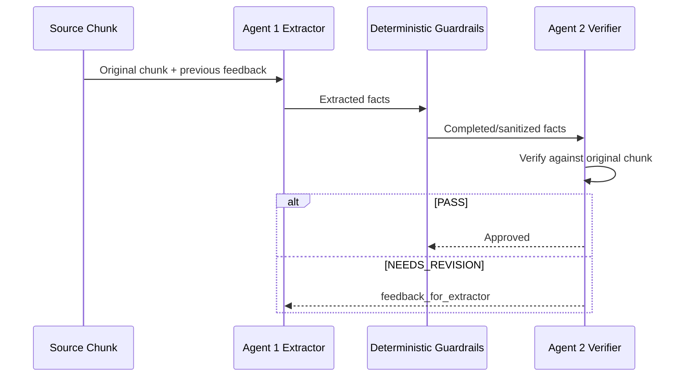

# Pipeline

This document describes the current medical report summarization pipeline.

## Stage 1A: XLSX Merge

Script:

```text
stage1_merge_chatml_all.py
```

Purpose:

- Read professor-level `.xlsx` files.
- Normalize `Professor_ID`, `수술ID`, `Input`, and `Output`.
- Merge all valid rows into one patient-level CSV.

Input columns required from each XLSX:

- `수술ID`
- `Input`
- `Output`

Output columns:

- `Professor_ID`
- `수술ID`
- `Input`
- `Output`

No LLM is used in this stage.

## Stage 1B: Document-Level Temporal Sorting

Script:

```text
stage1_temporal_document_sort.py
```

Purpose:

- Split each patient `Input` into source documents.
- Detect representative document dates and internal reference dates.
- Sort whole documents by conservative clinical phase and document date.
- Preserve each source document as raw text.

Typical source document chunks:

- Initial Consultation Note
- Preoperative Outpatient Note
- Operative Report
- Discharge Summary

Important distinction:

- This stage sorts **documents**, not individual clinical events inside a
  document.
- A document is moved as one unit after assigning a representative document
  date/phase.

No LLM is used in this stage.

## Stage 2: Core Fact Extraction and Verification

Script:

```text
stage2_core_fact_extraction_verification.py
```

Purpose:

- Split `Sorted_Timeline` into source document chunks.
- Run Agent 1 extraction on each chunk.
- Run Agent 2 verification on each chunk.
- Feed Agent 2 feedback back to Agent 1 if revision is needed.
- Stop when the chunk passes verification or reaches `max_iterations`.
- Merge chunk-level facts into one patient-level output row.

Current default model:

```text
qwen3.5:9b
```

Current default max iterations:

```text
2 per chunk
```

One chunk iteration uses two LLM calls:

1. Agent 1 fact extraction
2. Agent 2 fact verification

For one patient with four chunks:

```text
4 chunks x 1 iteration x 2 agents = 8 LLM calls
```

Worst case with `max_iterations=2`:

```text
4 chunks x 2 iterations x 2 agents = 16 LLM calls
```

## Stage 2 Fact Categories

Allowed categories:

- Primary Diagnosis
- Past Medical History
- Key Imaging/Test
- Operation
- Intraoperative Findings
- Pathology
- Hospital Course
- Discharge Plan
- Medication
- Complication
- Procedure Change
- Other

## Verification Loop



## Pass Criteria

A chunk passes when:

- `coverage_score >= 0.85`
- `evidence_support_score >= 0.95`
- no unsupported facts
- no contradictions
- no date errors
- no critical missing facts
- no clinical accuracy issues

Minor omissions may remain non-blocking to keep the full-dataset run tractable.

## Deterministic Guardrails

High-risk facts are checked with rule-based logic in addition to LLM verification:

- PFT mapping:
  - FVC 2.50 L (101%)
  - FEV1 1.99 L (116%)
  - FEV1/FVC 80%
- Operative core facts:
  - complete enucleation
  - no mucosal injury
  - no mucosal layer entry
  - lacerated lung surface repair
  - azygos vein division
  - chest tube placement
- Taxonomy:
  - VATS-to-open conversion is `Procedure Change`, not `Complication`.
  - `Complication: No` is preserved when present.
- Prompt-leak filtering:
  - Facts not supported by the chunk are removed if they appear to originate
    from prompt guidance.

